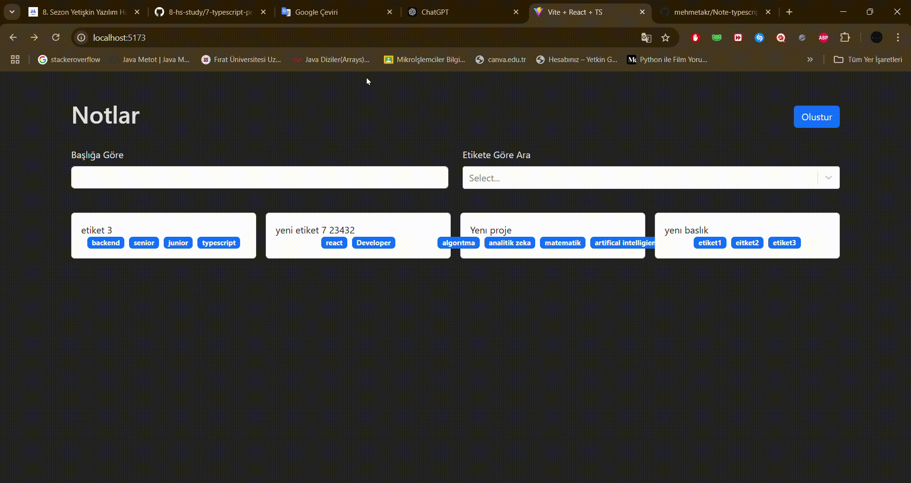

# Note Application Typescript

Bu proje, kullanıcıların not ekleyip düzenleyebileceği basit bir not alma uygulamasıdır.

  Özellikler
Yeni not ekleme
Mevcut notları görüntüleme
Notları düzenleme ve silme
Teknolojiler
TypeScript
React
CSS (stil için)

# Proje Gif

<h1> Kullanım </h1>
   * Yeni bir not eklemek için "Not Ekle" butonuna tıklayın.

  *  Mevcut notlarınızı liste halinde görüntüleyin ve düzenleme veya silme işlemlerini gerçekleştirin.
